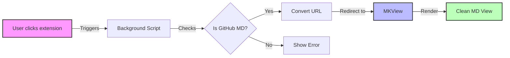

# Chrome Extension Demo Project

This is a sample README to demonstrate markdown rendering capabilities, including Mermaid diagrams and syntax-highlighted code blocks. It's perfect for testing your Chrome extension's markdown viewing functionality.

## Project Architecture

The following Mermaid diagram shows the basic flow of our extension:



## Code Example

Here's a simple Java Hello World program that demonstrates syntax highlighting:

```java
public class HelloWorld {
    public static void main(String[] args) {
        // Print welcome message
        System.out.println("Hello, Chrome Extension Developer!");
        
        // Display extension status
        boolean isExtensionActive = true;
        if (isExtensionActive) {
            System.out.println("Your extension is working perfectly!");
        }
    }
}
```

## Testing Notes

When testing your extension with this README:
1. Verify that the Mermaid diagram renders correctly
2. Check if code syntax highlighting works
3. Confirm that the overall markdown formatting is preserved
4. Test both light and dark mode rendering

## Next Steps

- Test with more complex Mermaid diagrams
- Add support for other programming languages
- Implement additional markdown features
- Test with longer documents

## Test Scenarios

The following table outlines various test scenarios for the Chrome extension:

| Test Case | Expected Behavior | Priority | Status |
|-----------|------------------|----------|--------|
| GitHub README.md | Auto-convert and display in clean view | High | ✅ |
| Private Repository | Show appropriate error message | High | 🟡 |
| Non-markdown Files | Disable extension button | Medium | ⏳ |
| Large Markdown Files | Handle loading states gracefully | Medium | 🟡 |
| Code Blocks > 100 lines | Show scrollbar, maintain highlighting | Low | ⏳ |

*Legend:*
- ✅ Implemented
- 🟡 In Progress
- ⏳ Planned
