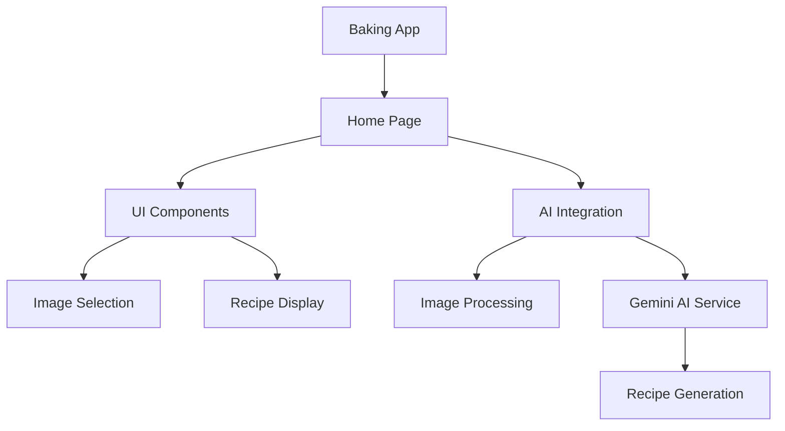
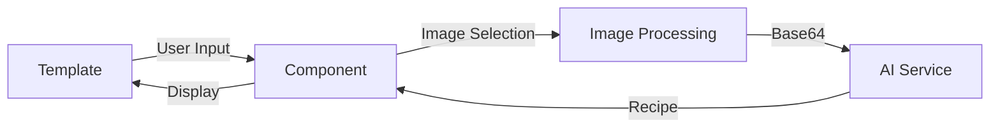
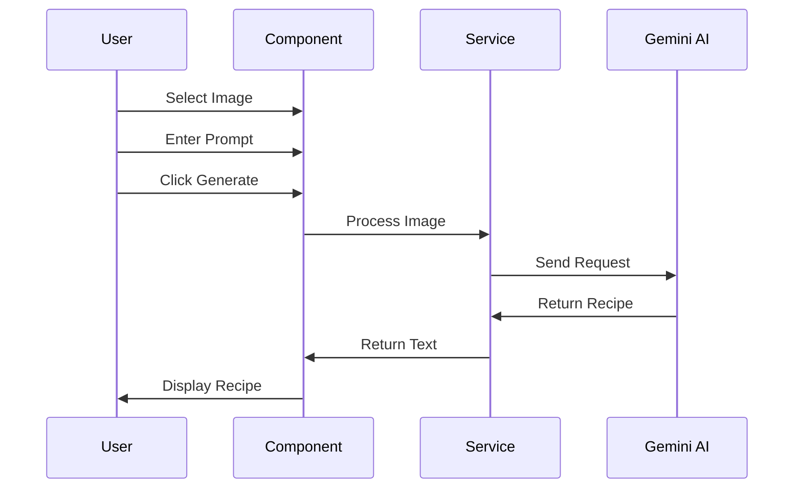
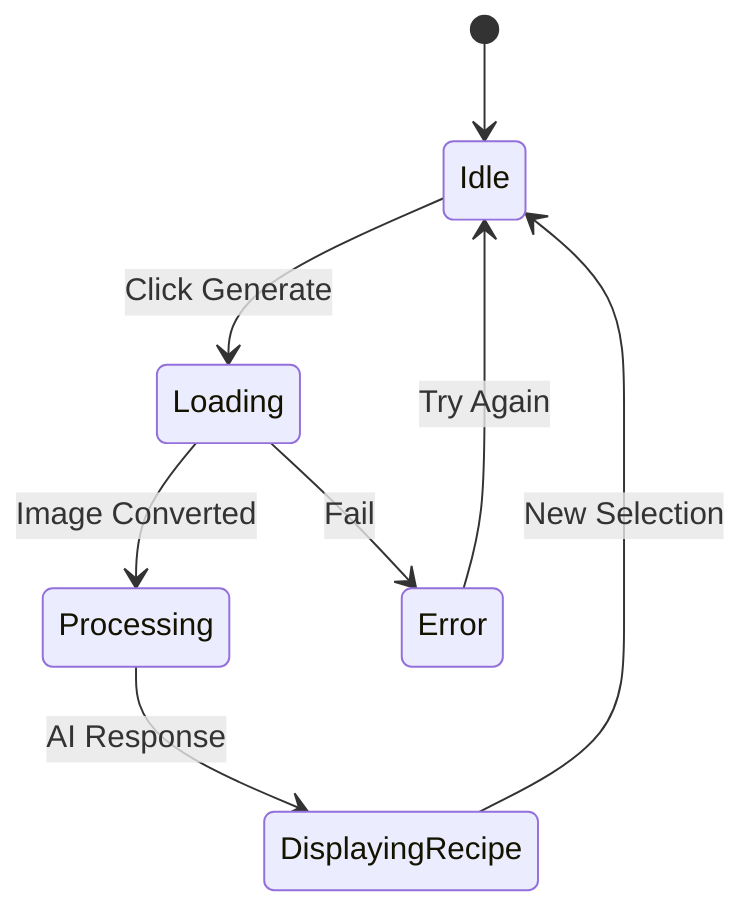
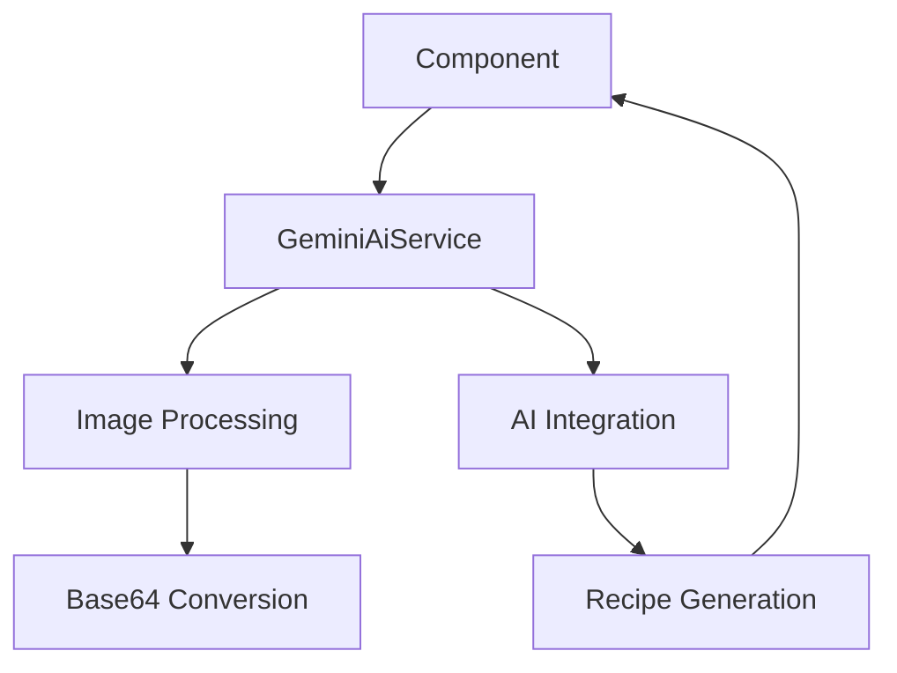
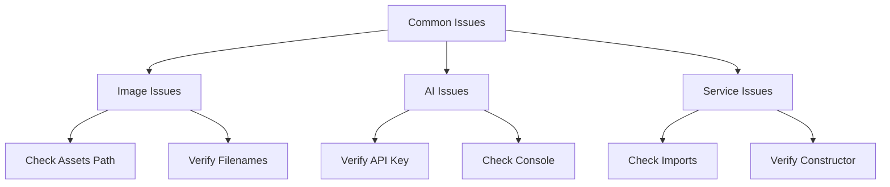

# Week 7 Lab: AI Recipe Generator

## Overview
In this lab, you'll create an app that generates recipes from pictures of baked goods using AI. You'll learn about:
- Working with Ionic components
- Handling images
- Using AI services
- Creating Angular services

## Project Architecture
Here's how our app will be structured:



## Component and Data Flow
This diagram shows how data moves through our application:



## Project Setup

### Step 1: Create Your Project
```bash
ionic start w7-lab-ai blank --type=angular
```
Select 'Yes' when asked about using Angular standalone components.

### Step 2: Install Required Package
```bash
cd w7-lab-ai
npm install @google/generative-ai
```

### Step 3: Add Environment Configuration
Append the following lines to the bottom of the `.gitignore` file. This is very important, as it prevents your API key from being saved to GitHub where bad actors could use it maliciously.  
```bash
# Environment files
/src/environments/environment.ts
```

Update the `src/environments/environment.ts` file with your API key.
```typescript
export const environment = {
  production: false,
  apiKey: 'YOUR-API-KEY-HERE'  // Your instructor will provide this
};
```
You can get an API key from [Google AI Studio](https://aistudio.google.com)

## Building the App

### Understanding Component Interaction



### Step 1: Update Component Imports
Open `src/app/home/home.page.ts` and replace its contents with:

```typescript
import { Component } from '@angular/core';
import { CommonModule } from '@angular/common';
import { FormsModule } from '@angular/forms';
import { IonHeader, IonToolbar, IonTitle, IonContent, 
         IonGrid, IonRow, IonCol, IonCard, IonCardContent, 
         IonCardHeader, IonCardTitle, IonItem, IonLabel, 
         IonButton, IonIcon, IonProgressBar, IonText,
         IonRadioGroup, IonRadio, IonImg, IonTextarea,
         IonRippleEffect } from '@ionic/angular/standalone';
import { GoogleGenerativeAI } from '@google/generative-ai';
import { environment } from '../../environments/environment';

@Component({
  selector: 'app-home',
  templateUrl: './home.page.html',
  standalone: true,
  imports: [
    // TODO: Add all the Ionic components from the imports above
    // HINT: Copy each component name from the imports list
    CommonModule, 
    FormsModule,
    // YOUR CODE HERE
  ]
})
export class HomePage {
  // TODO: Add default prompt
  // HINT: Something like "Provide a recipe for these baked goods"
  prompt = ''; 
  output = '';
  isLoading = false;

  availableImages = [
    { url: 'assets/images/baked_goods_1.jpg', label: 'Baked Good 1' },
    { url: 'assets/images/baked_goods_2.jpg', label: 'Baked Good 2' },
    { url: 'assets/images/baked_goods_3.jpg', label: 'Baked Good 3' }
  ];

  selectedImage = this.availableImages[0].url;

  get formattedOutput() {
    return this.output.replace(/\n/g, '<br>');
  }

  selectImage(url: string) {
    // TODO: Set the selectedImage property
    // HINT: this.selectedImage = url;
  }
}
```

### Step 2: Create the Template
Replace `src/app/home/home.page.html` with:

```html
<ion-header>
  <ion-toolbar color="primary">
    <ion-title>Baking with Gemini</ion-title>
  </ion-toolbar>
</ion-header>

<ion-content class="ion-padding">
  <form (ngSubmit)="onSubmit()">
    <!-- Image selection grid -->
    <ion-grid>
      <ion-row>
        @for (img of availableImages; track img.url) {
          <ion-col size="12" sizeMd="4">
            <ion-card class="ion-activatable" (click)="selectImage(img.url)">
              <!-- TODO: Add ion-img -->
              <!-- HINT:
              <ion-img [src]="img.url"></ion-img>
              -->
              
              <ion-ripple-effect></ion-ripple-effect>
              <ion-card-content>
                <!-- TODO: Add radio button group -->
                <!-- HINT:
                <ion-radio-group [(ngModel)]="selectedImage" name="imageSelect">
                  <ion-item lines="none">
                    <ion-radio [value]="img.url" slot="start"></ion-radio>
                    <ion-label>{{ img.label }}</ion-label>
                  </ion-item>
                </ion-radio-group>
                -->
              </ion-card-content>
            </ion-card>
          </ion-col>
        }
      </ion-row>
    </ion-grid>
    
    <ion-card>
      <ion-card-content>
        <!-- TODO: Add textarea -->
        <!-- HINT:
        <ion-textarea
          [(ngModel)]="prompt"
          name="prompt"
          label="Instructions"
          labelPlacement="floating"
          [autoGrow]="true"
          rows="2"
          class="ion-margin-bottom"
        ></ion-textarea>
        -->

        <ion-button 
          type="submit" 
          expand="block"
          class="ion-margin-top"
          [disabled]="isLoading"
        >
          <ion-icon name="cafe-outline" slot="start"></ion-icon>
          {{ isLoading ? 'Generating...' : 'Generate Recipe' }}
        </ion-button>
      </ion-card-content>
    </ion-card>

    @if (output) {
      <ion-card>
        <ion-card-header>
          <ion-card-title>Generated Recipe</ion-card-title>
        </ion-card-header>
        <ion-card-content>
          <ion-text [innerHTML]="formattedOutput"></ion-text>
        </ion-card-content>
      </ion-card>
    }

    @if (isLoading) {
      <ion-progress-bar type="indeterminate"></ion-progress-bar>
    }
  </form>
</ion-content>
```

### Step 3: Add the Images
1. Create folder: `src/assets/images/`
2. Add the provided images:
   - `baked_goods_1.jpg`
   - `baked_goods_2.jpg`
   - `baked_goods_3.jpg`

### Understanding Application States



### Step 4: Add Initial Submit Method
Add this method to your HomePage class:

```typescript
async onSubmit() {
  if (this.isLoading) return;
  this.isLoading = true;
  
  try {
    const response = await fetch(this.selectedImage);
    const blob = await response.blob();
    const base64data = await new Promise<string>((resolve) => {
      const reader = new FileReader();
      reader.onloadend = () => resolve(reader.result as string);
      reader.readAsDataURL(blob);
    });
    const base64String = base64data.split(',')[1];

    // TODO: Add Gemini AI code here
    // HINT: Follow these steps:
    // 1. Create the AI client
    // 2. Get the model
    // 3. Call generateContent
    // 4. Update this.output
    
  } catch (e) {
    this.output = `Error: ${e instanceof Error ? e.message : 'Something went wrong'}`;
  }
  
  this.isLoading = false;
}
```

### Step 5: Add the AI Integration
Add this code in the TODO section of onSubmit:

```typescript
const genAI = new GoogleGenerativeAI(environment.apiKey);
const model = genAI.getGenerativeModel({ model: 'gemini-1.5-flash' });

const result = await model.generateContent({
  contents: [{
    role: 'user',
    parts: [
      { 
        inlineData: { 
          mimeType: 'image/jpeg', 
          data: base64String
        } 
      },
      { text: this.prompt }
    ]
  }]
});

this.output = result.response.text();
```

### Service Architecture



### Step 6: Creating the Service

1. Create new service called ``gemini-ai`` and place it in the services folder:
```bash
ionic generate service services/gemini-ai
```

```typescript
import { Injectable } from '@angular/core';
import { GoogleGenerativeAI } from '@google/generative-ai';
import { environment } from '../../environments/environment';

@Injectable({
  providedIn: 'root'
})
export class GeminiAiService {
  private readonly MODEL_NAME = 'gemini-1.5-flash';
  
  async getImageAsBase64(imageUrl: string): Promise<string> {
    // TODO: Move image conversion code here
    // HINT: Copy the code from your component that:
    // 1. Fetches the image
    // 2. Converts to blob
    // 3. Converts to base64
    // 4. Returns the base64 string
  }

  async generateRecipe(imageBase64: string, prompt: string): Promise<string> {
    try {
      // TODO: Move AI generation code here
      // HINT: Copy the code that:
      // 1. Creates the AI client
      // 2. Gets the model
      // 3. Calls generateContent
      // 4. Returns the response text
      
    } catch (error) {
      throw new Error('Failed to generate recipe');
    }
  }
}
```

3. Update your component to use the service:

```typescript
// Add to imports
import { GeminiAiService } from '../services/gemini-ai.service';

// Add constructor
constructor(private geminiService: GeminiAiService) {}

// Update onSubmit method
async onSubmit() {
  if (this.isLoading) return;
  this.isLoading = true;
  
  try {
    // TODO: Use service methods
    // HINT:
    // const base64Image = await this.geminiService.getImageAsBase64(this.selectedImage);
    // this.output = await this.geminiService.generateRecipe(base64Image, this.prompt);
    
  } catch (e) {
    this.output = `Error: ${e instanceof Error ? e.message : 'Something went wrong'}`;
  }
  
  this.isLoading = false;
}
```

### Step 7: Testing
1. Run your app:
```bash
ionic serve
```

2. Check that:
   - Images display correctly
   - You can select different images
   - The generate button works
   - You get recipe output

## Common Issues and Solutions



1. If images don't show:
   - Check the assets folder path
   - Check image filenames
2. If AI doesn't work:
   - Check the API key
   - Check browser console for errors
3. If service doesn't work:
   - Check import paths
   - Make sure constructor is added

## Finishing Features
1. Add a "Copy Recipe" button
2. Add loading animations
3. Add error handling
4. Add 3 more images

## What You've Learned
- Creating an Ionic app
- Working with AI APIs
- Using Angular services
- Handling images and base64 conversion

Remember:
- Test frequently
- Check console for errors
- Ask for help when stuck
